# How to use Markdown
---
**1. Heading**
    - Sử dụng dấu #
    - Ví dụ: # Title
    - Số lượng dấu # tương ứng với title level, lớn nhất là 1 và nhỏ nhất là 6
    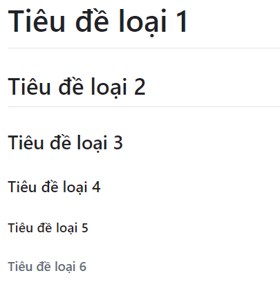
**2. Bold**
    - Bôi đậm sử dụng cú pháp như sau `**bold text**` hoặc `__bold text__`
    - Bôi đen chỗ text cần bôi đậm và nhấn tổ hợp phím `Ctrl + B`
**3. Italic**
    - In nghiêng sử dụng cú pháp như sau `*intalic text*` hoặc `_intalic text_`
    - Bôi đen chỗ text cần in nghiêng và nhấn tổ hợp phím `Ctrl + I`
    - Vừa bôi đậm vừa in nghiêng:
    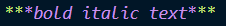
    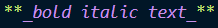
**4. Nhấn mạnh**
    - Nhấn mạnh hay còn gọi là inline code sử dụng cú pháp như sau:
    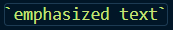
    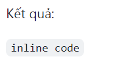
**5. Strikethrough**
    - Strikethrough sử dụng cú pháp như sau `~~strikethrough text~~`
    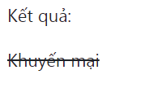
**6. Chèn link**
    - Sử dụng cú pháp `[Tên mong muốn hiển thị](Đường dẫn)`
    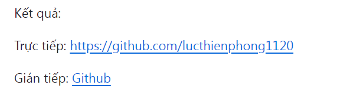
**7. Chèn ảnh**
    - Sử dụng cú pháp ``
    - Hoặc đơn giản và copy ảnh và paste trực tiếp vào
**8. Chèn code**
    - Sử dụng cú pháp
    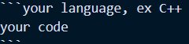
    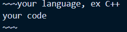
**9. Blockquote**
    - Sử dụng cú pháp `> quoted text`
    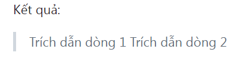
**10. Tạo list**
    - Sử dụng 1. 2. 3. ...
    - Sử dụng `-`, `+`, `*`
    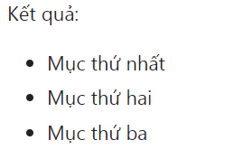
**11. Tạo dấu gạch ngang dài**
    - Sử dụng cú pháp `---` hoăc `***` hoặc `___`
    - Có thể sử dụng từ 3 dấu gạch `-` trở lên
    - Kết quả:
    
**12. Table**
    - Cú pháp cơ bản:
    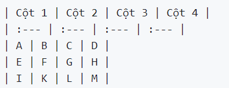
    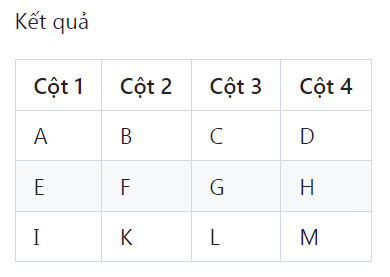
**13. Tạo checkbox**
    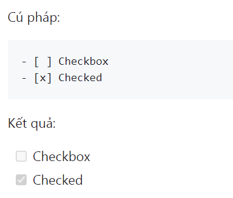
**14. Escape markdown**
    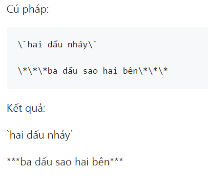
**15. Emoji**
    Refer link: https://github.com/lucthienphong1120/Github-Emojis/blob/main/README.md
    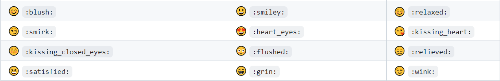
**16. Terminology**
    - TOC: Table of Contents